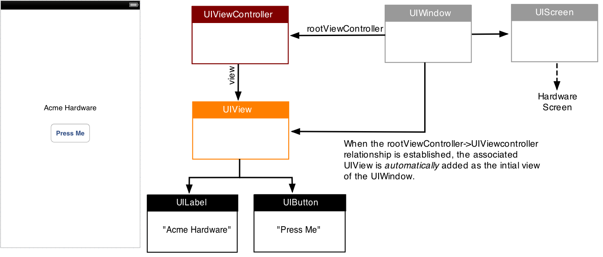

## Chapter 01 첫 번째 iOS 앱 만들기

- **뷰컨트롤러(View Controller)**

  - 하위에 있는 **콘텐츠를 관리**하고 **보여주거나 숨기**는 등의 구성을 조정하는 역할
  
  - 화면 전환이 발생할 때 **다른 뷰 컨트롤러와 서로 통신**하고 조정
  
  - 역할 : 뷰와 리소스를 관리 --> UIViewController 클래스를 상속받아야 함 
  
    
    
    
  
- **화면 구성 객체** : 수많은 UIView 객체가 모인 Window는 이들을 화면으로 구성하여 Screen 객체에 보내고, Screen 객체는 이를 물리적인 기기에 표시

  - **UIScreen** : 기기에 연결되는 물리적인 화면을 정의하는 객체 (우리가 흔히 접하는 화면 구성 요소 대부분)

  - **UIWindow** : 화면 그리기 지원 도구를 제공하는 객체
    - MVC패턴에 따라 화면 구성 시 Window에 뷰 객체를 바로 할당하면 안됨 -> *Window에 뷰 컨트롤러를 할당해서 뷰 컨트롤러가 자동으로 자신에게 첨부된 뷰들을 화면에 추가하도록 해야 함*
  - **UIView** : 그리기를 수행할 객체 세트

### 1.1 첫번째 앱, Hello World!

- AppeDelegate.swift
  - 앱 전체의 생명 주기 관리를 위임받은 객체인 앱 델리게이트를 구현한 클래스
  - 앱 전체에 적용해야 할 기능을 담당하는 클래스 
  - 앱이 실행되고 종료될 때, 활성화 상태가 되거나 비활성화 상태가 될때, 백그라운드 상태로 들어가는 등의 다양한 상태 변화를 감지하고 이에 대한 처리를 해 주어야 할 때
- ViewController.swift
  - 뷰 컨트롤러를 구현한 클래스 (화면 구현)
- Storyboard
  - 유저 인터페이스를 종합적으로 구현
    - Main.storyboard : 앱의 사용자 인터페이스 설계 담당
    - LounchScreen.storyboard : 앱을 실행하면 처음 나타나는 시작 화면 구성하는데 사용